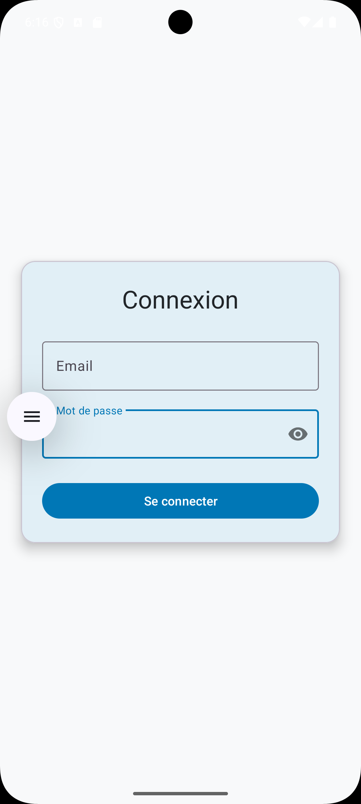
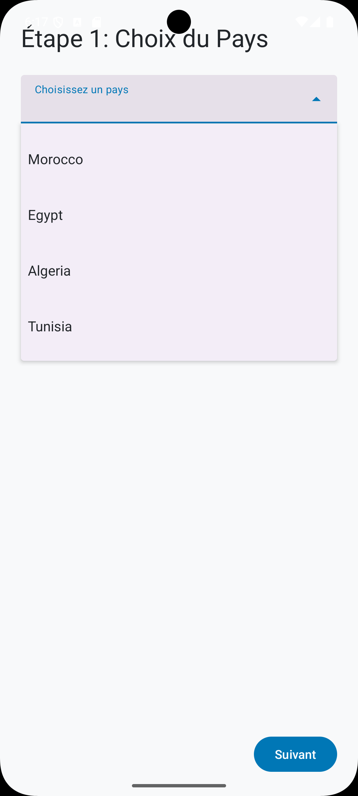
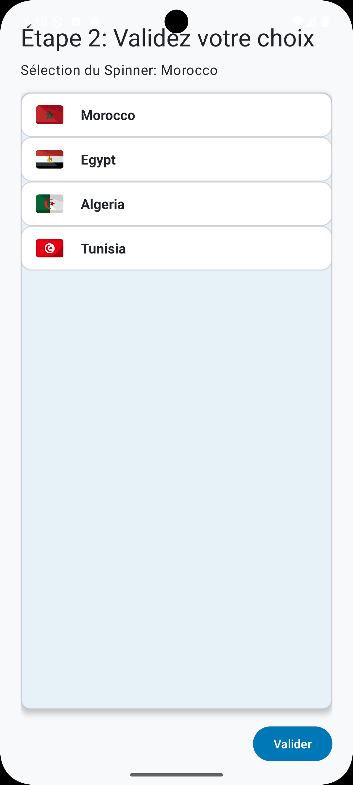
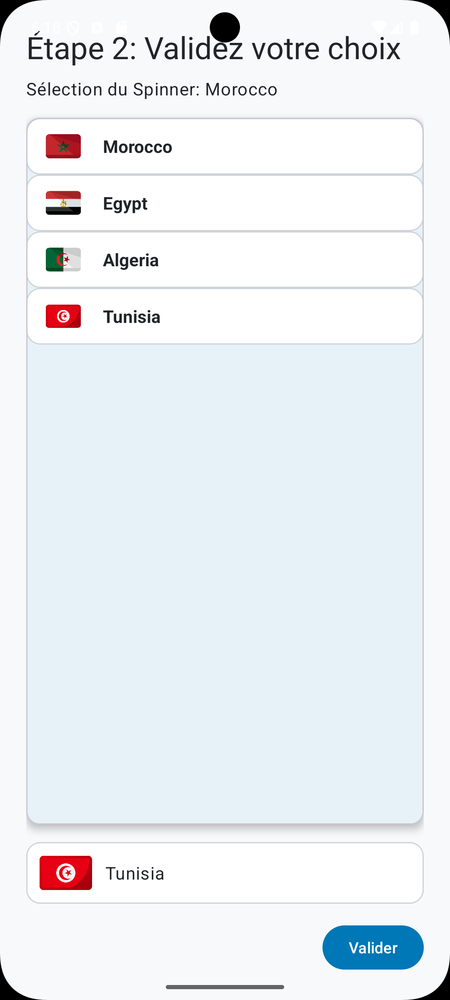
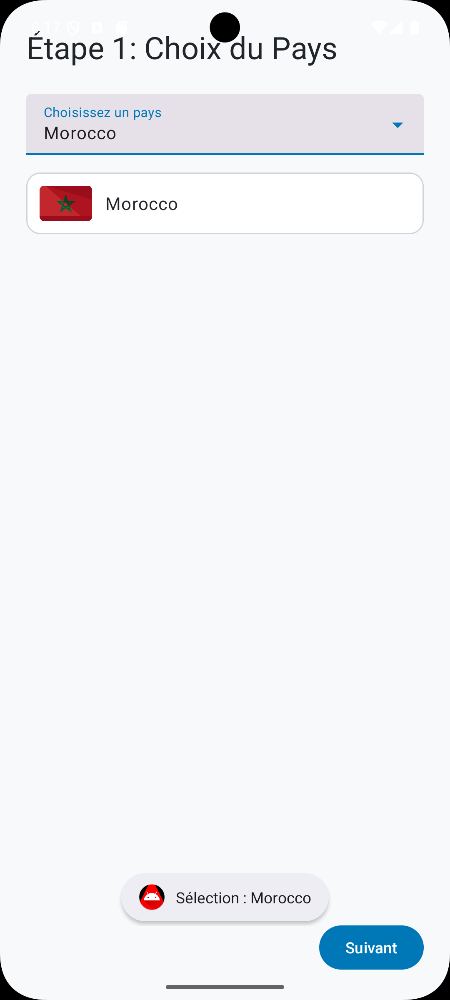
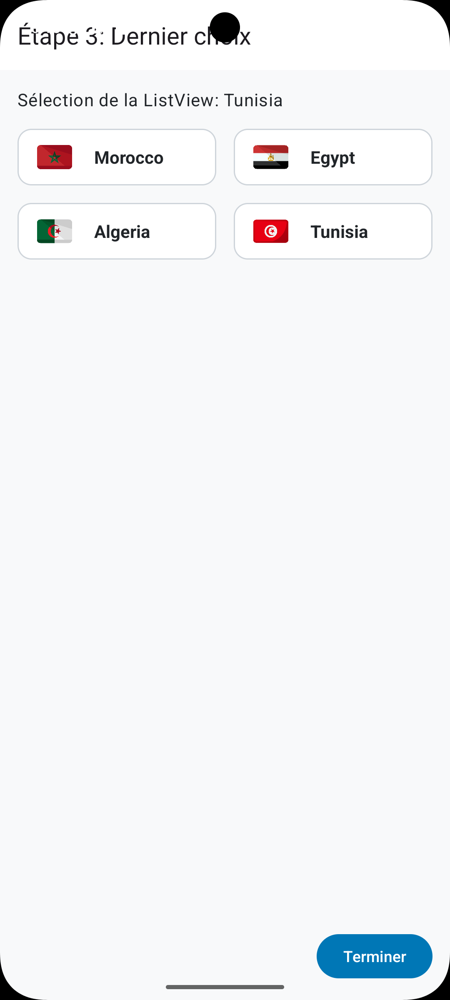
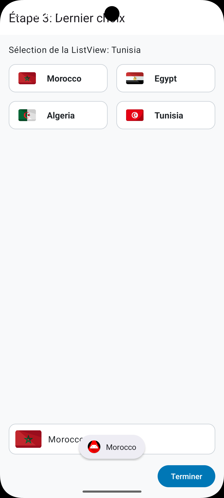
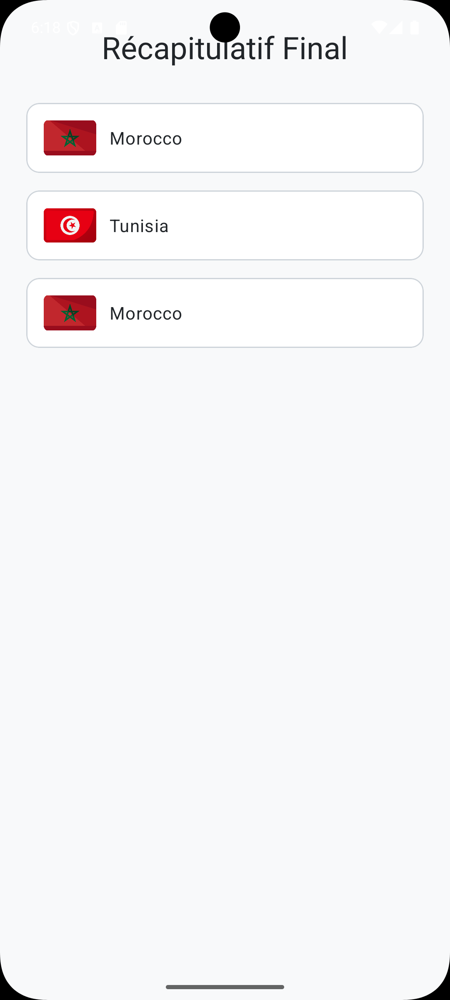

# Tp4FullApp

## Description
Application mobile complète développée dans le cadre du TP5. Cette application permet aux utilisateurs de se connecter avec des identifiants prédéfinis et d'accéder à différentes fonctionnalités comme la gestion des salles.

## Auteur
**Rayan El Habib**

## Contact

  &nbsp;&nbsp;&nbsp;&nbsp;
  &nbsp;&nbsp;&nbsp;&nbsp;
  

## Fonctionnalités
- Authentification utilisateur (identifiants: admin@gmail.com / admin)
- Tableau de bord après connexion
- Gestion des salles
- Page de confirmation
- Intégration des boutons de connexion Google, Facebook et GitHub

## Structure du projet
Voici les principales activités de l'application :
- **LoginActivity** : Écran de connexion avec validation des identifiants
- **DashboardActivity** : Tableau de bord principal après connexion
- **SalleActivity** : Gestion des salles
- **ConfirmationActivity** : Page de confirmation

## Images de l'application
L'application contient les ressources graphiques suivantes :
- ic_launcher_background : Icône de fond de l'application
- ic_launcher_foreground : Icône de premier plan de l'application
- facebook.png : Bouton de connexion Facebook
- github.png : Bouton de connexion GitHub
- google.png : Bouton de connexion Google

Voici des captures d'écran montrant le design et les différentes étapes de l'application :

*Page de connexion*

*Étape 1 avec spinner*

*Étape 2 - Vue liste 1*

*Étape 2 - Vue liste 2*

*Étape 2 - Élément spinner*

*Étape 3 - Vue grille 1*

*Étape 3 - Vue grille 2*

*Récapitulatif final*

## Installation
1. Clonez ce dépôt
2. Ouvrez-le dans Android Studio
3. Compilez et exécutez l'application

## Technologies utilisées
- Java
- Android SDK
- XML
- Material Design Components

## Identifiants de connexion
Pour accéder à l'application, utilisez les identifiants suivants :
- Email : admin@gmail.com
- Mot de passe : admin